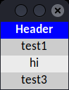

# EditableListbox
Create a listbox where you can edit the rows.
- Each item is a label with its own click events.
- Each item transforms into an Entry while editing the row.

(EditableListbox is Poikilos' fork of David Duran's ListBoxEditable.)

## Differences in Poikilos fork
- Preserve the value when changing to entry mode.
- Store names in a list and generate them separately from the values.
- Press the enter/return key to end entry.
- Use PEP8 such as for:
  - spacing
  - variable and method naming (constant all caps convention, word order
    in grammatically-correct order etc.) such as renaming
    `placeListBoxEditable` to `gridAll`, `ListBoxEditable` to
    `EditableListbox`, etc.
  - module naming
  - private method `_` convention
  - Move documentation comments to docstrings.
- See [changelog.md](changelog.md) for more.

## Authors & License
[MIT License](license.txt)
- (c) 2017-2020 David Duran on <https://stackoverflow.com/a/44204790/4541104>
  answered May 26, 2017 at 15:04
  edited Aug 1, 2020 at 14:02
- (c) 2022 Jake "Poikilos" Gustafson (edited by): see [changelog.md](changelog.md)

The license changed 2022-08-07 with permission:
> Good job @Poikilos. Yes, you can change the license to MIT. By the way, if you need help in the future on maintaining the repository (i.e. solving some issues), I can give you a hand. Best regards, David. –
> [David Duran](https://stackoverflow.com/users/2726773/david-duran)
> [Aug 7 at 10:40](https://stackoverflow.com/questions/17937039/tkinter-listbox-with-entry/44204790?noredirect=1#comment129392837_44204790)
